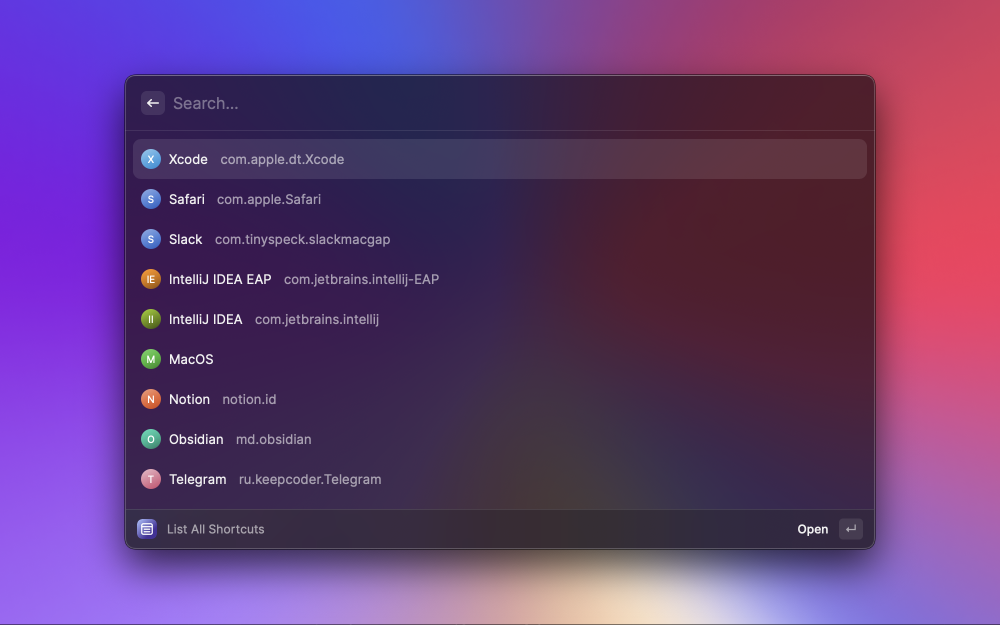
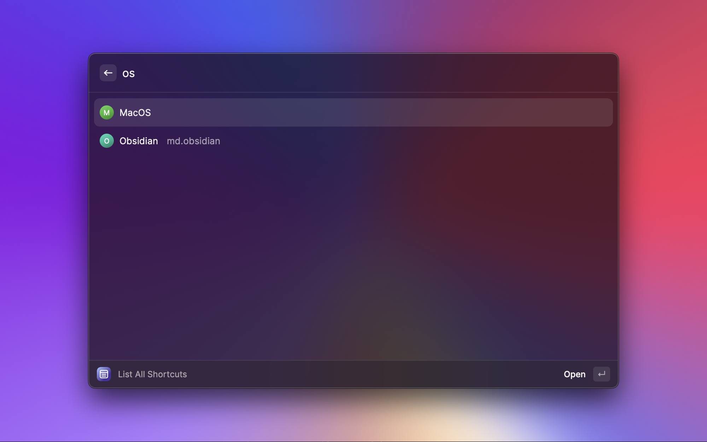
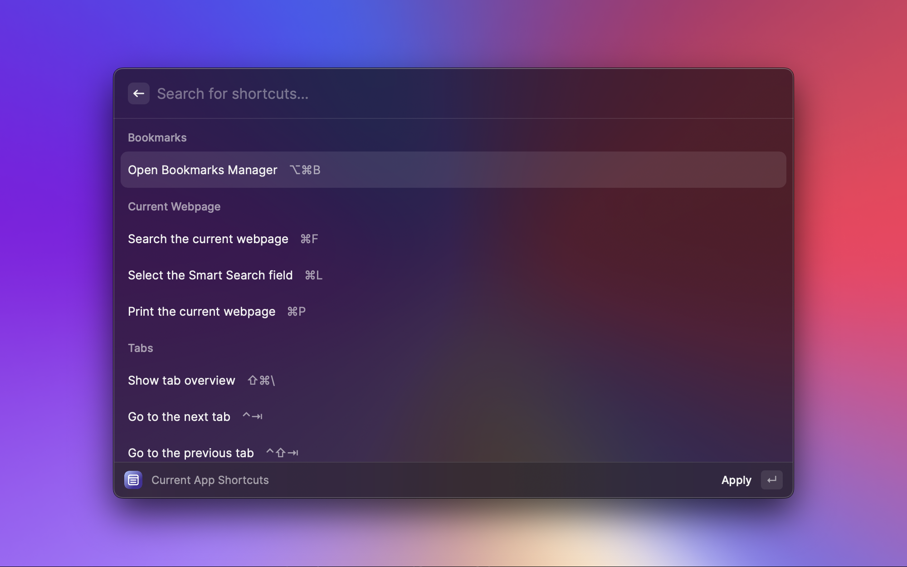
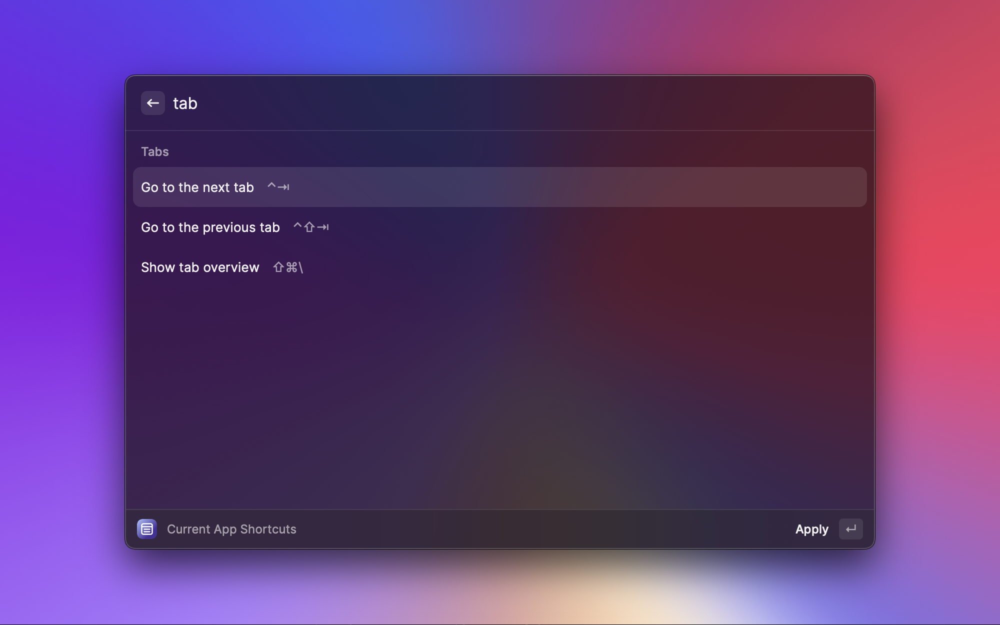

# Shortcuts Search RayCast extension

Allows to list, search and run shortcuts for different applications.

By selecting shortcut extension actually runs the shortcut using AppleScript.

Data is taken from: https://hotkys.com.

Please see contribution guide for adding new shortcuts [here](https://github.com/solomkinmv/hotkys/blob/main/README.md#shortcuts-contribution).

## Commands

### List All Shortcuts

Show shortcuts for all available desktop or web applications. When signed in,
the public catalog is merged with custom applications and shortcut changes from
your Hotkys account. Use the app filter to switch between All Apps, My Apps,
and favorite applications.

### List Current Shortcuts

Show shortcuts for the frontmost desktop application. Command will exit if no desktop application
is detected or if it is missing in the Hotkys database. Signed-in custom
shortcuts are merged into the public shortcuts automatically.

### List Current Web Shortcuts

Show shortcuts for the frontmost web application. Command will exit if no web application
is detected or if it is missing in the Hotkys database. Signed-in custom
shortcuts are merged into the public shortcuts automatically.

- Supported browsers: Safari, Chrome, Arc.
- Not supported browsers: Firefox.

### Copy Current App's Bundle ID

Saves current app's bundle id in the clipboard. Useful for contributing new shortcuts.

Selecting My Apps or Favorites, or adding an application or shortcut to
Favorites, starts Hotkys sign-in when needed. Custom shortcut authoring remains
available on [hotkys.com](https://hotkys.com).

## Authentication and database access

The extension uses Clerk OAuth PKCE and talks directly to Supabase; no custom
server or client secret is required. Concurrent reads share a refresh request.
Temporary network/server errors preserve the login for retry; an explicit
`invalid_grant` response requires signing in again.

OAuth database access is limited to reading your profile and customizations,
creating your own profile on first use, and reading/adding/removing favorites.
It cannot edit profiles, preferences, or custom shortcuts. Website permissions
are unchanged.

For an existing database, apply
`shortcuts-disco-site/supabase/migrations/20260907211100_restrict_clerk_oauth_permissions.sql`
after the original OAuth migration. Updating the extension alone does not
restrict existing database permissions. `shortcuts-disco-site/supabase/schema.sql`
contains the same restrictions for fresh setup or SQL-editor reruns.

Run `npm test` in this directory for extension regressions. From
`shortcuts-disco-site`, run `npm run test:rls` for isolated PostgreSQL permission
tests (no Docker or production credentials needed). These test both the schema
and upgrade migration, but do not verify Clerk's hosted token verification or
the interactive browser sign-in flow.

## Screenshots

